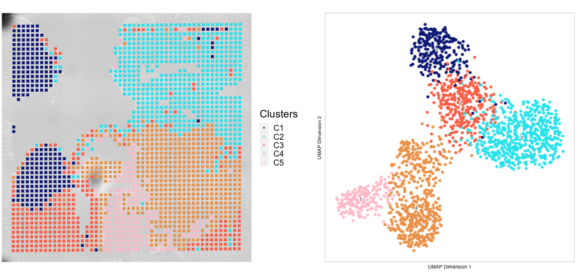
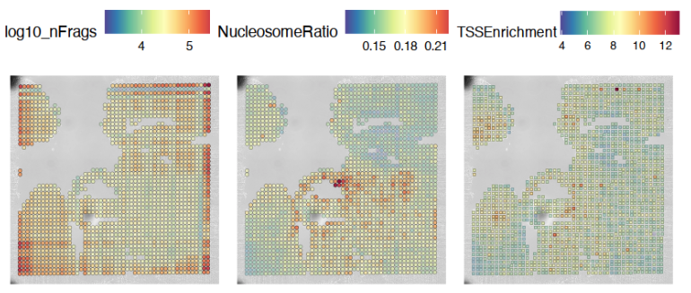
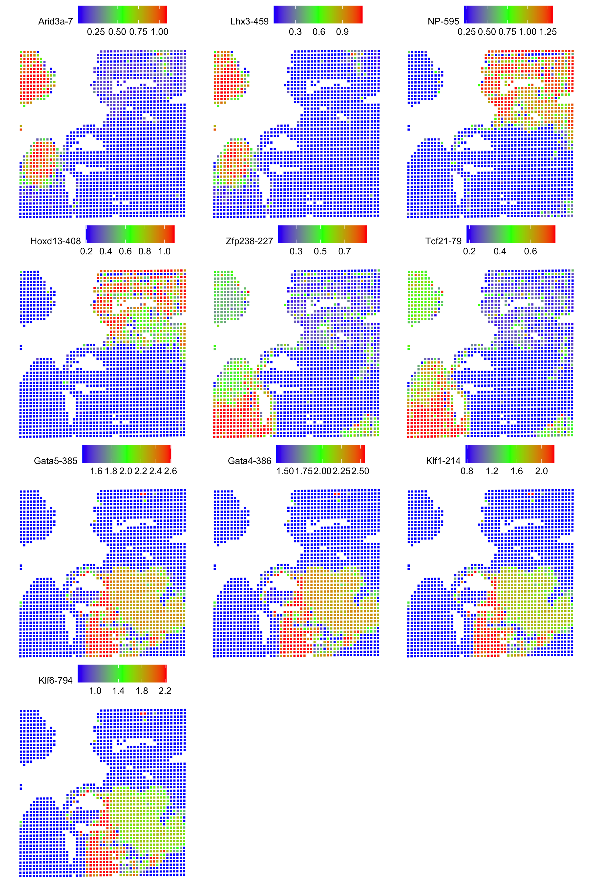

Spatial Epigenome 
_________________

Overview of Visualization  Workflow
------------------------------------
This tutorial aims to provide a brief introduction to getting started with basic downstream spatial ATAC analysis
prepared by the Deterministic Barcoding in Tissue for Spatial Omics Sequencing (DBiT-seq) protocol. Much of
this tutorial centers around the usage of both `ArchR  <https://www.archrproject.com/bookdown/index.html>`_
and `Seurat <https://satijalab.org/seurat>`_ to create a spatially resolved ATAC object from which ATAC gene scores are mapped
back to the tissue histology. Each step in this analysis workflow closely follows standard scATAC downstream analysis 
as outlined in ArchR's tutorial. 

For this quickstart, we will be using D357, a mouse embryo dataset generated by the DBiT protocol.

Dependencies
------------
Load needed libraries: ::

   library(ArchR)
   library(Seurat)
   library(patchwork)
   library(gridExtra)
   library(dplyr)
   library(tibble)
   library(clusterProfiler)
   library(org.Mm.eg.db)
   library(repr)
   library(purrr)
   library(presto)
   library(ggseqlogo)
   library(chromVARmotifs)

Before starting downstream analysis in ArchR, a few global parameters must be set: ::

Inputs
-------------
Data species, number of threads, tile size, genome size, minimum TSS, minimum fragments, and set seed are all parameters that can be specified when using the ArchR R package for basic downstream spatial ATAC analysis prepared by the DBiT-seq protocol.

**Data species** refers to the type of organism being analyzed, such as mouse 'mm10', human 'hg38', rat 'rnor6', or a custom reference.

**Number of threads** specifies the number of parallel threads to use when running the analysis, which can improve the efficiency of the analysis by allowing it to run on multiple cores of a computer's processor. An integer must be assigned to num_threads specifying the number of threads to use for ArchR. 

**Tile size** specifies the size of the tiles that will be used to divide the genome into smaller regions for analysis. For tile size we define an integer specifying the bin size of the genome.

**Genome size** specifies the size of the genome being analyzed.

**Minimum TSS and minimum fragments** specify the minimum number of transcription start sites and fragments that must be detected in a region for it to be considered significant. min_Frags refers to the minimum number of mapped ATAC-seq fragments required per tixel when creating arrowFile(s).

**Set seed** is a parameter that can be used to specify a seed value for the random number generator used by the analysis, which can be useful for reproducing results. ::
  
  data_species <- 'mm10'
  num_threads <- 1
  tile_size <- 5000  
  genomeSize = 3.0e+09
  min_TSS <- 0
  min_Frags <- 0
  set.seed(1234)
  #Path to fragments.tsv.gz located in <sample>_cellranger_outs/
  inputFile <- "./test_data/D00357_cellranger_output/fragments.tsv.gz"
  project_name <- 'Control'
  # Path to spatial folder located in <sample>
  spatialFolder <- './test_data/Spatial/D357/spatial'
  

ArchR Project Creation
---------------------------
Once generating the needed fragments.tsv file outputted from Cellranger for a specific sample, we can now create
an ArchR **ArrowFile** which will form the basis of our ATAC analysis. During the ArrowFile creation step, all of the
necessary data and metadata for the given sample will be generated and stored on disk in HD5 format. A few parameters such as 
minTSS and minFrags, which respectively denote the lowest TSS enrichment score and lowest number of fragments can
be passed to filter out any poor quality tixels from the dataset. For simplicity of this tutorial, all tixels are included as they are needed to map back the log-scaled fragment counts to the tissue_positions.csv file. For reference, archR also allows subsetting on projects based on tixel names. For future reference, see `subsetArchRProject  <https://www.archrproject.com/reference/subsetArchRProject.html>`_. Here, an ArrowFile for a single fragments.tsv associated with an 
arbitrary 'Control' sample is created::
   
   addArchRGenome(data_species)
   geneAnnotation <- getGeneAnnotation()
   genomeAnnotation <- getGenomeAnnotation()
   addArchRThreads(threads = num_threads)
   
   ArrowFiles <- createArrowFiles(
      inputFiles = inputFile,
      sampleNames = project_name,
      geneAnnotation = geneAnnotation,
      genomeAnnotation = genomeAnnotation,
      minTSS = min_TSS,
      minFrags = min_Frags,
      maxFrags = 1e+07,
      addTileMat = TRUE,
      addGeneScoreMat = TRUE,
      offsetPlus = 0,
      offsetMinus = 0,
      force = TRUE,
      TileMatParams = list(tileSize = tile_size)
   )

ArchR accesses this data by associating the newly created ArrowFiles with an **ArchRProject**. An ArchRProject is 
a data structure stored in memory that can be easily accessed/mutated by R. Every operation on the ArchRProject affects its associated
ArrowFile. All of the archR downstream analysis will take place on the ArchRProject. To create an ArchRProject, pass in the previously
created ArrowFiles object to the ArchRProject function call ::

   proj <- ArchRProject(
      ArrowFiles = ArrowFiles, 
      outputDirectory = project_name,
      geneAnnotation = geneAnnotation,
      genomeAnnotation = genomeAnnotation,
      copyArrows = TRUE
   )
   
Spatial Object Creation
-----------------------------
Given sparsity of ATAC data, we compute dimensionality reduction via the IterativeLSI technique and perform clustering using the standard Seurat v3 community neighborhood detection method via **addClusters(…)**. Clusters are then embedded into a UMAP space purely for visualization purposes. Once clustering is computed, spatial information contained in the folder generated by AtlasXBrowser is integrated. To
do so, we use Seurat's Read10X_image function to create a 10X Visium-like object called **image** containing all the spatial folder information. Here, off-tissue tixels are filtered out in both the image object and in the ArchRProject, creating a new project **proj_in_tissue**. The gene 
score matrix containing all gene accessibility scores and metadata are then extracted from proj_in_tissue and passed as parameters to Seurat's **CreateSeuratObject** function call. The image object is then added to the "slice1" slot of the newly created Seurat object. Once the gene-score matrix and imaging data are succesfully integrated, we now have a spatially-resolved ATAC object containing all of the information and metadata computed in ArchR. ::

   ############### Prepare meta.data
   meta.data <- as.data.frame(getCellColData(ArchRProj = proj))
   meta.data['cellID_archr'] <- row.names(meta.data)
   new_row_names <- row.names(meta.data)
   new_row_names <- unlist(lapply(new_row_names, function(x) gsub(".*#","", x)))
   new_row_names <- unlist(lapply(new_row_names, function(x) gsub("-.*","", x)))
   row.names(meta.data) <- new_row_names

   ############### Filtering off-tissue tixels using image data
   image = Read10X_Image(image.dir = spatialFolder, filter.matrix = TRUE)
   sequenced_tixels <- row.names(meta.data)
   image <- image[sequenced_tixels, ]
   meta.data.spatial <- meta.data[row.names(image@coordinates), ]
   proj_in_tissue <- proj[meta.data.spatial$cellID_archr, ]

   ############### Dimension reduction, clustering, and add UMAP embedding
   proj_in_tissue <- addIterativeLSI(
      ArchRProj = proj_in_tissue,
      useMatrix = "TileMatrix", 
      name = "IterativeLSI", 
      iterations = 2, 
      clusterParams = list(
      resolution = c(0.2), 
      sampleCells = 10000, 
      n.start = 10
      ), 
      varFeatures = 25000, 
      dimsToUse = 1:30,
      force = TRUE
   )

   proj_in_tissue <- addClusters(
      input = proj_in_tissue,
      reducedDims = "IterativeLSI",
      method = "Seurat",
      name = "Clusters",
      resolution = 0.5,
      force = TRUE
   )

   proj_in_tissue <- addUMAP(
      ArchRProj = proj_in_tissue, 
      reducedDims = "IterativeLSI", 
      name = "UMAP", 
      nNeighbors = 30, 
      minDist = 0.5, 
      metric = "cosine",
      force = TRUE
   )

   ############## Creating Seurat object
   gene_score <- getMatrixFromProject(proj_in_tissue)
   rownames(gene_score) <- rowData(gene_score)$name
   proj_in_tissue <- addImputeWeights(proj_in_tissue)
   gene_score <- imputeMatrix(assay(gene_score), getImputeWeights(proj_in_tissue))
   gene_score <- log(gene_score+1, base = 2)
   colnames(gene_score) <- gsub(pattern = paste0(project_name, "#|-1"), replacement = "", x= colnames(gene_score))

   object <- CreateSeuratObject(counts = gene_score, assay = "Spatial", meta.data = meta.data)

   image <- image[Cells(x = object)]
   DefaultAssay(object = image) <- "Spatial"
   object[["slice1"]] <- image
   spatial_in_tissue.obj <- object

   spatial_in_tissue.obj$orig.ident = as.factor(project_name)
   Idents(spatial_in_tissue.obj) = 'orig.ident'
   spatial_in_tissue.obj = AddMetaData(spatial_in_tissue.obj, spatial_in_tissue.obj@images$slice1@coordinates)        
                               

Once the spatial objects are generated, various metadata and gene score information can be plotted
back to spatial images using standard Seurat functions such as SpatialDimPlot. Optional aesthetic parameters such as **pt_size_factor** and **cols** are passed to control size of the tixel and color palette displayed in the graphic::
   
   ############## Define aesthetic parameters
   n_clusters <- length(unique(proj_in_tissue$Clusters))
   palette  = c("navyblue", "turquoise2", "tomato", "tan2", "pink", "mediumpurple1", "steelblue", "springgreen2","violetred", "orange", "violetred", "slateblue1",  "violet", "purple",
                "purple3","blue2",  "pink", "coral2", "palevioletred", "red2", "yellowgreen", "palegreen4",
                 "wheat2", "tan", "tan3", "brown",
                 "grey70", "grey50", "grey30")
   cols <- palette[seq_len(n_clusters)]
   names(cols) <- names(proj_in_tissue@sampleMetadata)
   names(cols) <- paste0('C', seq_len(n_clusters))
   cols_hex <- lapply(X = cols, FUN = function(x){
       do.call(rgb, as.list(col2rgb(x)/255))
   })
   cols <- unlist(cols_hex)
   pt_size_factor <- 1
   
   ############## Plotting UMAP/cluster identities to spatial histology
   spatial_in_tissue.obj@meta.data$Clusters = proj_in_tissue$Clusters
   plot_spatial = Seurat::SpatialDimPlot(
       spatial_in_tissue.obj,
       label = FALSE, label.size = 3,
       group.by = "Clusters",
       pt.size.factor = pt_size_factor, cols = cols, stroke = 0) +
       theme(
          plot.title = element_blank(),
          legend.position = "right",
          text=element_text(size=21)) +
          ggtitle(project_name) + theme(plot.title = element_text(hjust = 0.5), text=element_text(size=21))

   plot_spatial$layers[[1]]$aes_params <- c(plot_spatial$layers[[1]]$aes_params, shape=22)
   
   plot_umap = plotEmbedding(
     ArchRProj = proj_in_tissue,
     pal = cols,
     colorBy = "cellColData",
     name = "Clusters",
     embedding = "UMAP",
     size = 2) +
     theme(
       plot.title = element_blank(),
       legend.position = "none",
       text=element_text(size=21))
   
   cluster_plots <- plot_spatial + plot_umap
   cluster_plots

Additional Visualizations
-----------------------------
Various metadata metrics found in metadata slot can be plotted. Here, quality metrics like log-scaled fragment counts, nucleosome ratios, and TSS enrichment scores are plotted against each tixel's spatial coordinate. Optional graphical aesthetics are applied to the figures: ::

   ############## Plotting quality control metrics to spatial histology
   spatial_in_tissue.obj@meta.data$log10_nFrags <- log10(spatial_in_tissue.obj@meta.data$nFrags)
   plot_metadata = SpatialFeaturePlot(
     object = spatial_in_tissue.obj,
     features = c("log10_nFrags", "NucleosomeRatio", "TSSEnrichment"),
     alpha = c(0.2, 1), pt.size.factor = pt_size_factor) + 
     theme(plot.title = element_text(hjust = 0.5), text=element_text(size=10))
   plot_metadata$layers[[1]]$aes_params <-c(plot_metadata$layers[[1]]$aes_params, shape=22)

   plot_metadata
   

  
Standard ArchR plotting can be used with the computed **proj_in_tissue** project. For more information on
function methodology and documentation, please see ArchR's `tutorial  <https://www.archrproject.com/bookdown/index.html>`_

..  
Spatial Plots of Enriched Motifs 
----------------------------------------------------

We use the ArchR package to perform motif enrichment analysis on the dataset and identify enriched motifs. We then use the Seurat package to add 
spatial data to the analysis and plot the spatial data using the enriched motifs as the features. This allows us to visualize which motifs are enriched 
in specific regions of the tissue, visualize it's spatial distribution, and gain insights into the regulation of gene expression in the tissue.

**Call peaks**
------------------------------------------------------------------------

**Add group coverages**

The addGroupCoverages function serves several important purposes in the analysis of single-cell ATAC data. Firstly, it helps to address the binary nature of the data by creating pseudo-bulk replicates. Additionally, it prepares the data for peak-calling and helps to determine the reproducibility of the peak-calling step. Gene score information is available which attempts to assign an accessibility "score" to each gene based on the number of peaks near its transcription start site (TSS). Therefore, while addGroupCoverages does not directly measure gene expression, it calculates the average coverage of each genomic region or "peak" in the dataset, grouped by a specific metadata column such as Clusters. This allows us to compare the average accessibility score of each peak across different cell types or clusters, providing insights into various cluster characteristics.::

    proj_in_tissue <- addGroupCoverages(ArchRProj = proj_in_tissue, groupBy = "Clusters")

**Call peaks using MACS2** 

It's also important to identify accessible genomic regions that are consistently expressed across multiple samples. These are called "peaks" and can be identified using software like MACS2. We call the addReproduciblePeakSet function to call peaks on our dataset (proj_in_tissue) and add the results to the object. To use this function, we pass in the ArchRProj object, the name of the metadata column to group the peaks by (Clusters), the path to the MACS2 program, and the size of the genome we're analyzing. We also set the force parameter to TRUE, which tells the function to re-run peak calling even if it's already been done (useful if we've made changes to our dataset).::

    pathToMacs2 <- findMacs2()
    proj_in_tissue <- addReproduciblePeakSet(
      ArchRProj = proj_in_tissue,
      groupBy = "Clusters",
      pathToMacs2 = pathToMacs2,
      genomeSize = genomeSize,
      force = TRUE
   )

Add peak matrices
------------------------
To store and retrieve peak calls efficiently, use the addPeakMatrix function to add a peak matrix to the proj_in_tissue object. This matrix will store the peak calls which are regions of the genome that show an enrichment of reads when compared to a background.::

   proj_in_tissue <- addPeakMatrix(proj_in_tissue)

Motif enrichment (Deviation)
----------------------------------------
**Add motif annotations** 

Use the addMotifAnnotations function to add motif annotations to the ArchR project. The motif set used will depend on the data species. If the species is "hg38" or "mm10", the "cisbp" motif set is used. Otherwise, the "encode" motif set is used and the species information is obtained from the project's genome.::

      proj_in_tissue <- addMotifAnnotations(ArchRProj = proj_in_tissue, motifSet = "encode", name = "Motif", force = TRUE, species = getGenome(ArchRProj = proj_in_tissue))

   
**Add background peaks** 
Use the addBgdPeaks() function to add background peak information to the ArchRProj. The force argument is set to TRUE so that it'll overwrite any existing background peak information in the object. ::

   proj_in_tissue <- addBgdPeaks(proj_in_tissue, force = TRUE)

**Add deviations matrix**
Use the addDeviationsMatrix() function to add a matrix of per-cell deviations to the ArchRProj object. The peakAnnotation argument specifies the name of the peak annotations to use when calculating the deviations.::

   proj_in_tissue <- addDeviationsMatrix(
      ArchRProj = proj_in_tissue, 
      peakAnnotation = "Motif",
      force = TRUE
    )

Get marker motifs
--------------------------------
**Save project object**
Save the project as an RDS file using the saveRDS() function. RDS files are a binary file format so it can be loaded and used in future analyses ::

   saveRDS(proj_in_tissue, paste0(project_name, "_spatial_markerMotifs.rds"))

Get marker features and create list of enriched motifs
--------------------------------------------------------

To identify markers that are specific to certain clusters, use getMarkerFeatures() function to find marker features within the ArchRProj object. The identified markers are then filtered using getMarkers() and stored in the markersMotifs variable. ::

   markersMotifs <- getMarkerFeatures(
   ArchRProj = proj_in_tissue,
   useMatrix = "MotifMatrix",
   groupBy = "Clusters",
   bias = c("TSSEnrichment", "log10(nFrags)"),
   testMethod = "wilcoxon",
   useSeqnames = 'z'
   )
   
**Get marker motifs** ::

   markerMotifsList <- getMarkers(markersMotifs,
   motifs <- list()
    for (i in seq_len(length(markerMotifsList))) {
      if (length(markerMotifsList[[i]]$name)>1) {
        motifs <- c(motifs, markerMotifsList[[i]]$name[[1]])
        motifs <- c(motifs, markerMotifsList[[i]]$name[[2]])
      }
    }

If the input list of motifs has more than one element, convert the motif to a string, and add a "z:" prefix to each motif, remove duplicate motifs, 
and assign the resulting list of motifs to the variable motifs. We do this to create a list of enriched motifs that are specific to certain clusters. 
::

     if (length(motifs)>1) {
       motifs <- unlist(motifs)
       motifs <- paste0('z:', motifs)
   motifs <- unique(motifs)

Apply addImputeWeights to the input Seurat object and assign the result to the variable proj_in_tissue. This step is done to improve the accuracy of the marker features by imputing missing values.::

   proj_in_tissue <- addImputeWeights(proj_in_tissue)
   
Source the getDeviation_ArchR.R, getGeneScore_ArchR.R, SpatialPlot_new.R, and SpatialDimPlot_new.R script. The source function reads in these scripts that contain R code for specific functions and visualizations to be used in our current R session. ::
   
   source(paste0(script.dir, "/", "getDeviation_ArchR.R"))
   source(paste0(script.dir, "/", "getGeneScore_ArchR.R"))
   source(paste0(script.dir, "/", "SpatialPlot_new.R"))
   source(paste0(script.dir, "/", "SpatialDimPlot_new.R"))

Deviation scores and matrices
----------------------------------------
Use the getDeviation_ArchR() function to get the deviation scorematrix from the archR project. The function takes the ArchR project object, the list of motifs, and the imputed weights computed with getImputeWeights(). Assign the resulting deviation scores to the variable dev_scores. ::

   dev_score <- getDeviation_ArchR(ArchRProj = proj_in_tissue, name = motifs, imputeWeights = getImputeWeights(proj_in_tissue))

Set all NA values in dev_score to 0. ::

   dev_score[is.na(dev_score)] <- 0 #min(dev_score, na.rm = TRUE)

**Create Seurat object**
Create a new Seurat object using the dev_score matrix and the metadata from the input Seurat object, and assign the result to the variable object. ::

   object <- CreateSeuratObject(counts = dev_score, assay = "Spatial", meta.data = meta.data)

Filtering and setting default assay
----------------------------------------

Load image from a specified directory, filter the image based on the cells present in the object Seurat object, and set the image as the default assay 
for object.

Assign object to the variable spatial.obj. ::

   image <- Read10X_Image(image.dir = spatialFolder, filter.matrix = TRUE)
      image <- image[Cells(x = object)]
      DefaultAssay(object = image) <- "Spatial"
      object[['slice1']] <- image

   spatial.obj <- object

Creating Spatial plots for enriched motifs
------------------------------------------------

Create a list of plots called motif_list. For each enriched motif in the spatial.obj object, create a plot using SpatialPlot_new(). The features 
argument specifies the motif to plot, and the pt.size.factor argument specifies the size of the points on the plot. The image.alpha and stroke 
arguments control the transparency and stroke width of the plot. The alpha argument controls the transparency of the points on the plot. The min.cutoff 
and max.cutoff arguments specify the minimum and maximum values to include on the plot. Then sets the shape of the points to squares using the shape 
parameter. Add the resulting plot to motif_list. ::

   motif_list <- list()
      for(i in rownames(x=spatial.obj)){
        motif_list[[i]] <- SpatialPlot_new(spatial.obj, features=i, pt.size.factor = pt_size_factor, 
                                           image.alpha = 0, stroke = 0, alpha = c(1, 1),  min.cutoff = "q10", max.cutoff = "q90") + 
          theme(legend.position = "top", legend.text=element_text(size=9), legend.title=element_text(size=9))
        motif_list[[i]]$layers[[1]]$aes_params <- c(motif_list[[i]]$layers[[1]]$aes_params, shape=22) # set spots to square shape 
      }

**Create a combined plot** of all the individual motif plots using the wrap_plots function, specifying the number of columns. ::

   motif_plots <- wrap_plots(motif_list, ncol = 3)

**Save the combined plot as a PNG image.** ::

   png(file="./figure/motifs.png", width = 8, height=ceiling(length(motifs)/3)*3, unit="in", res = 300)
    print(motif_plots)
    dev.off()
   }
   

   
 **Generate List of ggplot Objects for Each Motif Plot**
Create individual motif plots by by generating a list of ggplot objects for each motif plot. It iterates over the row names of spatial.obj, extracts the motif PWM for each row, and converts it to a probability matrix. It then uses the probability matrix to create a ggplot object for the motif plot. The reason for this step is to create individual motif plots that can be combined into a single plot.::

   require(ggseqlogo)
     motif_pwm <- getPeakAnnotation(proj_in_tissue, "Motif")$motifs
     logo_list <- list()
     for(i in rownames(x=spatial.obj)){
    motif_ID <- motif_pwm[[str_replace(i, "-", "_")]] # change here
    mat <- TFBSTools::as.matrix(motif_ID)
    probmat <- exp(mat) * matrix(TFBSTools::bg(motif_ID), nrow = nrow(mat), ncol = ncol(mat),  byrow = FALSE)
    logo_list[[i]] <- ggseqlogo(probmat)
     }
     
**Combine Individual Motif Plots into One Plot** 

Use the wrap_plots function from the ggseqlogo package to combine the plots into one plot with multiple columns.::

     logo_plots <- wrap_plots(logo_list, ncol = 3)
   
      dev.off()

.. image:: /images/logos.png

  
