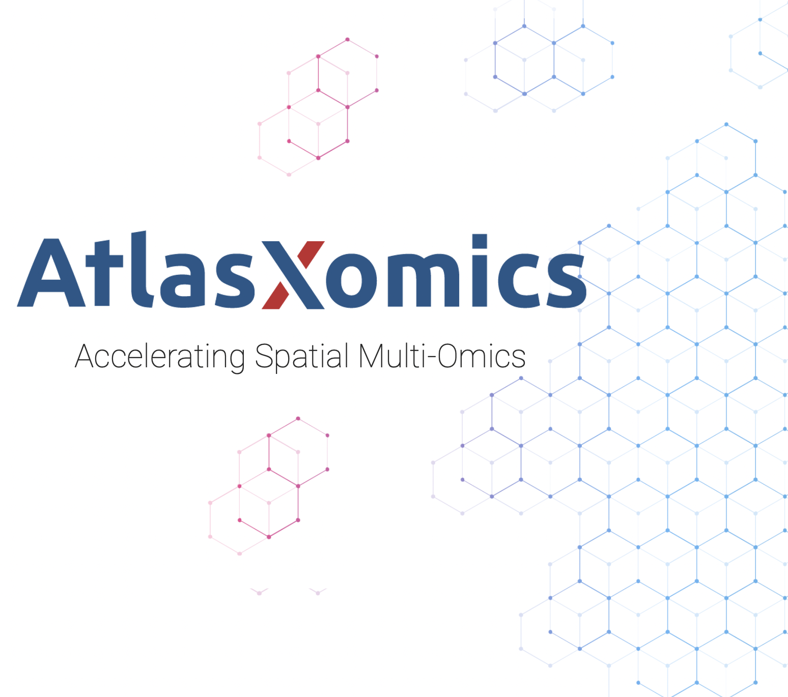

.. Introduction to ATAC Analysis with DBiT-seq documentation master file, created by
   sphinx-quickstart on Tue Oct 25 22:49:32 2022.
   You can adapt this file completely to your liking, but it should at least
   contain the root `toctree` directive.

Introduction to Spatial Epigenome Data Analysis (DBiT-seq)
=======================================================================
.. toctree::
   :caption: AtlasXbrowser:

   Overview <https://docs.atlasxomics.com/projects/AtlasXbrowser/en/latest/Overview.html>
   Installation <https://docs.atlasxomics.com/projects/AtlasXbrowser/en/latest/Installation.html>
   OpeningFolder <https://docs.atlasxomics.com/projects/AtlasXbrowser/en/latest/OpeningFolder.html>
   ImageConfiguration <https://docs.atlasxomics.com/projects/AtlasXbrowser/en/latest/ImageConfiguration.html>
   Thresholding <https://docs.atlasxomics.com/projects/AtlasXbrowser/en/latest/Thresholding.html>
   ROICharacterization <https://docs.atlasxomics.com/projects/AtlasXbrowser/en/latest/ROICharacterization.html>
   SpatialFolder <https://docs.atlasxomics.com/projects/AtlasXbrowser/en/latest/SpatialFolder.html>
   ExampleWalkthrough <https://docs.atlasxomics.com/projects/AtlasXbrowser/en/latest/ExampleWalkthrough.html>

.. toctree::
   :caption: AtlasXplore:

   Overview <https://docs.atlasxomics.com/projects/AtlasXplore/en/latest/Overview.html>
   Features and Navigation <https://docs.atlasxomics.com/projects/AtlasXplore/en/latest/Features_and_Navigation.html>
   Genome Browser <https://docs.atlasxomics.com/projects/AtlasXplore/en/latest/GenomeBrowser.html>
   Motif Search <https://docs.atlasxomics.com/projects/AtlasXplore/en/latest/MotifSearch.html>
   Lasso Selector <https://docs.atlasxomics.com/projects/AtlasXplore/en/latest/LassoSelector.html>
   Cell Type Labeling <https://docs.atlasxomics.com/projects/AtlasXplore/en/latest/CellTypeLabeling.html>
   Plot Saving <https://docs.atlasxomics.com/projects/AtlasXplore/en/latest/SavingPlots.html>
   FAQ <https://docs.atlasxomics.com/projects/AtlasXplore/en/latest/FAQ.html>

.. toctree::
   :maxdepth: 3
   :caption: AtlasXomics:

   Requirements
   SpatialEpigenome
   SpatialTranscriptome
   Spatial_Plots_Enriched_Motifs
   Glossary
   FAQ_Spatial_Epigenome

